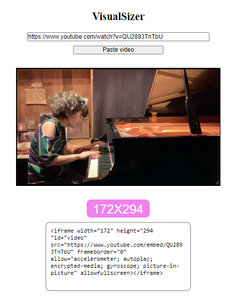
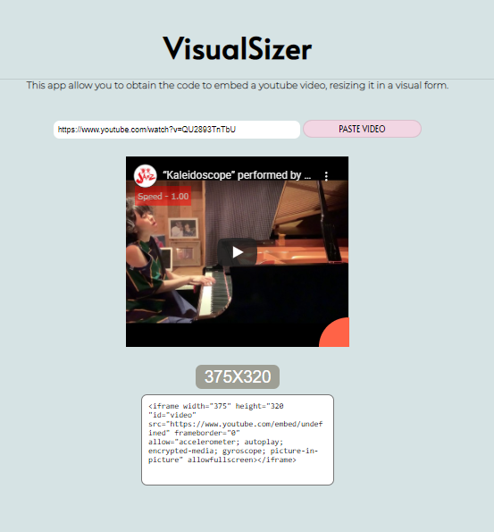
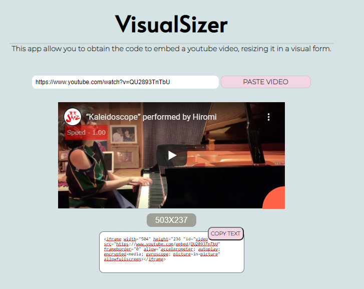
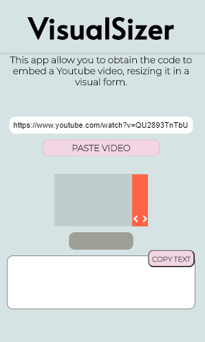
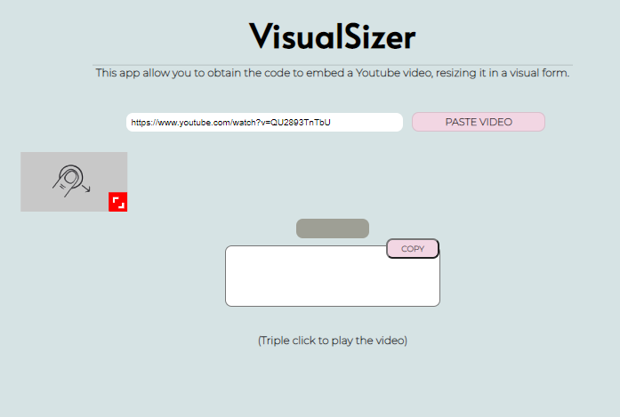
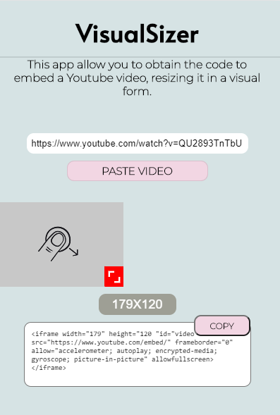

# VisualSizer

This app allow you to obtain the code to embed a youtube video, resizing it in a visual form.

https://em3c2.github.io/VisualSizer/

# How to use

1) Paste a URL in the input and press "Paste video"

Accepted url types: 
- https://www.youtube.com/watch?v=IDIDIDIDID
- https://youtu.be/IDIDIDIDID
- https://www.youtube.com/embed/IDIDIDIDID

2) Resize the video dragging to bottom and right.

3) Copy de HTML code to embed the video where you like! 

### ToDos:

- [ ] devolp the readme
- [ ] change fonts to a dyslexic friendly
- [ ] add a buttom to mantain the 16:9 ratio

### First version:

### Second version:
Better colors, added fonts, a bit more factoriced code.

### Third version:
Added "Copy" buttom and more style changes.

### Fourth version:
Changed the "resize" from CSS to JS vainilla, I learned to much doing this.

### fifth version:
Fixeds bugs.

